# PolyGraphRAG

<p align="center">
  
</p>

**A production FastAPI service for multimodal, multi-project knowledge-graph RAG** — ingest PDFs, Office docs, images, and audio; extract an entity/relationship **knowledge graph**; and query it with dual-level retrieval. Provider-agnostic, backed by **Postgres + pgvector + Apache AGE**.

<p>
  
  
  
  
  <a href="https://github.com/oleksandr-kushnir/polygraphrag/pkgs/container/polygraphrag"></a>
  
  <a href="https://www.linkedin.com/in/oleksandr-kushnir-ai/"></a>
</p>

PolyGraphRAG wraps [RAG-Anything](https://github.com/HKUDS/RAG-Anything) and [LightRAG](https://github.com/HKUDS/LightRAG) in a deployable HTTP API and adds the things you need to actually run graph-RAG as a service: **many isolated projects on one instance**, **asynchronous ingest jobs**, **pluggable model providers per role**, file lifecycle management, and an **interactive graph viewer**.

---

## 📥 Drop in any file → a GraphRAG database (embeddings + knowledge graph)

**No separate OCR service. No parsing pipeline to wire up. No extraction stack to babysit.** One upload endpoint swallows documents, images, and audio alike — OCR, layout parsing, transcription, and entity extraction all happen **inside this one service**. Whatever you send comes out the other side as a **GraphRAG store in Postgres: vector embeddings in pgvector *and* an entity/relationship knowledge graph in Apache AGE**, both queryable together. **22 first-class, verified file types**, and unknown extensions are still attempted (routed through MinerU, ingestion unverified).

| Category | How it's parsed | Extensions |
|----------|-----------------|------------|
| 📄 **Documents** | Vision model (Office → PDF via LibreOffice) | `pdf` · `docx` · `pptx` · `xlsx` |
| 🖼️ **Images** | Vision model, per file | `jpg` · `jpeg` · `png` · `gif` · `bmp` · `tiff` · `webp` |
| 🔊 **Audio** | Whisper transcription | `mp3` · `wav` · `m4a` · `ogg` · `flac` · `opus` · `webm` |
| 📝 **Text** | Ingested directly | `md` · `txt` · `csv` · `html` |

**One pipeline, one store, one query surface.** The extracted text is embedded into **pgvector** for semantic retrieval, and its entities/relationships are lifted into an **Apache AGE knowledge graph** — so queries traverse both the vectors *and* the graph, not just chunk similarity. Point it at a PDF, a screenshot, a spreadsheet, or a voice memo; the plumbing is already done.

---

## 🔀🤖 The perfect memory & knowledge backend for n8n workflows and AI agents

**Pure API, built for automators — every feature is an endpoint you can call.** No app to adopt, no dashboard to learn: you get a clean, fully-documented API plus a **Swagger UI** at `/docs` to explore and test it, and an interactive **graph viewer** you can fetch as HTML and drop straight into your own app or agent UI when you want to show the knowledge graph. It's exactly what you want when the "user" is a workflow or an agent — nothing between you and the automation.

**It's just HTTP + bearer auth — no SDK, no client library, no glue code.** Every capability is a plain REST call, so it drops straight into an **n8n HTTP Request node** or an **AI agent tool** with zero adapters:

- **Ingest** — wire a Google Drive / Gmail / webhook trigger straight into `POST /workspace/{id}/upload/batch`. Your automation feeds files in; PolyGraphRAG does the OCR, parsing, transcription, and graph-building.
- **Query as a tool** — give your agent `POST /workspace/{id}/query` for a synthesized answer, or `POST /workspace/{id}/query/data` for **structured evidence with no LLM answer** — ideal when the agent wants raw facts to reason over instead of prose.
- **Isolate per client/topic** — one workspace per project means an n8n workflow or a multi-tenant agent can keep every knowledge base cleanly separated on a single deployment.
- **A machine-readable contract** — `/openapi.json` declares typed response schemas for every endpoint (including the canonical ingest-job status enum) and advertises the Bearer/Basic auth scheme, so a tool-calling agent can learn the entire API from the spec alone, no live probing needed.

Retrieval-augmented n8n flows and tool-calling agents get a **multimodal, graph-aware knowledge store behind a single URL** — point your workflow at it and ship.

---

## Why it's interesting

- 🗂️ **Multi-project — multiple isolated knowledge graphs.** Every *workspace* is its own graph **and** its own vector namespace. Spin up as many projects as you like on a single deployment and ingest, query, and visualize each one completely independently. No cross-talk between corpora.
- 🔌 **Provider-agnostic, per role.** The extraction LLM, the query LLM, the vision model, embeddings, and Whisper are each independently pointed at OpenAI **or any OpenAI-compatible endpoint** (OpenRouter, DeepSeek, Ollama, vLLM, LM Studio, TEI…). Run cheap high-volume extraction on one provider and fast synthesis on another — configured entirely by environment variables.
- 🧩 **Genuinely multimodal.** PDFs and images go through a vision model, Office docs via LibreOffice, audio via Whisper, and text/markdown/CSV directly — 22 file types, one upload endpoint.
- 🕸️ **A real knowledge graph, not just chunks.** LightRAG extracts entities and relationships and stores them in **Apache AGE** (graph) + **pgvector** (embeddings) inside one Postgres. Query modes span local, global, hybrid, and naive retrieval, and `query/data` returns the structured evidence without an LLM answer.
- ⚙️ **Built to operate.** Async batch ingestion with per-file job tracking and integrity verification, soft-delete + restore of workspaces, per-file delete that correctly preserves entities shared with other documents, and a container `HEALTHCHECK`.
- ✅ **A fully mocked test suite (230+ tests).** The suite stubs RAG-Anything, LightRAG, and the database, so `pytest` runs green with **no Postgres and no API keys**.

## Architecture

```mermaid
flowchart LR
    client([Client / curl / app]) -->|HTTP| api[FastAPI service<br/>PolyGraphRAG]

    subgraph providers[Pluggable model providers &#40;per role&#41;]
      llm[Extraction + Query LLM]
      vis[Vision]
      emb[Embeddings]
      whis[Whisper]
    end

    api --> raga[RAG-Anything<br/>parsing + ingest pipeline]
    api --> lr[LightRAG<br/>graph build + retrieval]
    raga --> lr
    lr <--> llm
    raga <--> vis
    lr <--> emb
    raga <--> whis

    subgraph pg[Postgres]
      age[(Apache AGE<br/>knowledge graph)]
      vec[(pgvector<br/>embeddings)]
      meta[(file / job / workspace<br/>metadata)]
    end
    lr --> age
    lr --> vec
    api --> meta
```



Each workspace maps to a physical LightRAG namespace: the bootstrap `default` workspace (seeded only into an empty registry) uses the shared `chunk_entity_relation` AGE graph, and every workspace created via the API gets its own `{workspace}_chunk_entity_relation` graph plus workspace-scoped vector rows — that's what keeps projects isolated. Workspaces are peers; none is delete-protected.

## Requires Postgres to run

PolyGraphRAG's storage backend **is** Postgres (pgvector + Apache AGE + pg_trgm) — it can't serve requests without it. You don't need to set that up by hand: `docker compose up` builds and starts a correctly-extended Postgres alongside the API. The only thing that runs without a database is the **test suite**, which is fully mocked.

## Quickstart

```bash
cp .env.example .env          # set POSTGRES_PASSWORD + at least one API key
docker compose pull           # fetch prebuilt images from GHCR (fast path)
docker compose up -d          # start Postgres(+AGE) and the API
curl localhost:9622/health    # -> {"status":"ok"}
```

Prefer to build the images yourself (e.g. after changing the code)? Swap the middle
two commands for `docker compose up -d --build`.

Open **http://localhost:9622/docs** for the full interactive Swagger UI.

> **Auth is off by default** (the ports are loopback-only). To require credentials, set
> `API_TOKENS` in `.env` (comma-separated). Every endpoint except `/health` then needs a token:
> machines send `-H "Authorization: Bearer <token>"`; in a browser enter any username with the
> token as the password. Serve over TLS whenever you expose the service beyond loopback.
>
> **Scope:** single-instance, low-usage service — run **one worker/replica** (ingest job state
> is in-process). Not designed for high load or horizontal scaling.

### Ingest and query (end to end)

```bash
# 1. Create an isolated project/graph
curl -X POST localhost:9622/all-workspaces/create \
  -H 'content-type: application/json' \
  -d '{"id":"acme","name":"Acme Corp"}'

# 2. Upload one or more files (ingestion runs in the background)
curl -X POST localhost:9622/workspace/acme/upload/batch \
  -F 'files=@handbook.pdf'
# -> {"batch_id":"...","jobs":[{"job_id":"ab12cd34", ...}]}

# 3. Poll a job until it's "done" (statuses: pending/processing/retrying/done/failed)
curl localhost:9622/workspace/acme/status/ab12cd34

# 4. Query the knowledge graph
curl -X POST localhost:9622/workspace/acme/query \
  -H 'content-type: application/json' \
  -d '{"query":"How do we handle refunds?","mode":"mix"}'

# 5. Open the interactive graph in a browser
#    http://localhost:9622/workspace/acme/graph.html
```

**Citations point at your real files.** Upload with `source_path` + `path_root` metadata and every `/query` reference's `file_path` is the **real, openable document path** you provided (resolved from Postgres, not LightRAG's internal name) — so answers cite files your own tooling can open.

## API at a glance

| Area | Endpoints |
|------|-----------|
| Discovery & health | `GET /` (service card) · `GET /health` |
| Workspaces | `GET /all-workspaces/list` · `POST /all-workspaces/create` · `GET /workspace/{id}` · `DELETE /workspace/{id}` · `POST /workspace/{id}/restore` |
| Ingestion | `POST /workspace/{id}/upload/batch` · `GET /workspace/{id}/batch/{batch_id}` · `GET /workspace/{id}/status/{job_id}` · `GET /workspace/{id}/jobs` |
| Files | `GET /workspace/{id}/files` · `DELETE /workspace/{id}/file/delete` |
| Query | `POST /workspace/{id}/query` · `POST /workspace/{id}/query/data` |
| Visualization | `GET /workspace/{id}/graph.html` |

Full request/response details, query modes, and examples live in **[docs/api-reference.md](docs/api-reference.md)**.

## Configuration

Everything is environment-driven. The headline knob is **per-role provider routing**: for each of `LLM`, `QUERY_LLM`, `VISION`, `EMBEDDING`, and `WHISPER`, an empty `*_BASE_URL` means OpenAI, and a set one points at any OpenAI-compatible endpoint authenticated with the matching `*_API_KEY`.

A cost-optimized example — **DeepSeek (via OpenRouter) for the LLM, OpenAI for embeddings**:

```bash
LLM_MODEL=deepseek/deepseek-chat
LLM_BASE_URL=https://openrouter.ai/api/v1
LLM_API_KEY=sk-or-...
EMBEDDING_MODEL=text-embedding-3-small     # blank EMBEDDING_BASE_URL -> OpenAI
OPENAI_API_KEY=sk-...
```

See **[.env.example](.env.example)** for every variable and **[docs/configuration.md](docs/configuration.md)** for the full routing matrix and caveats (e.g. changing `EMBEDDING_MODEL`/`EMBEDDING_DIM` repoints the vector tables and requires re-ingestion).

## Testing

```bash
python -m venv .venv && . .venv/Scripts/activate   # or source .venv/bin/activate
pip install -r requirements-dev.txt
pytest -q                                          # all green — no Postgres, no keys
```

The suite mocks RAG-Anything, LightRAG, and the Postgres pool — no external services, no keys.

Two smoke tests live in **[scripts/](scripts/)**:

```bash
python scripts/smoke_test.py          # in-process ASGI smoke (stubs, no DB/keys)
./scripts/smoke_test_docker.sh        # live HTTP smoke against a running stack
```

## Project layout

```
.
├── server/              # the FastAPI service (package: app + routers + services)
│   ├── __init__.py      #   app assembly, lifespan, /health, router wiring
│   ├── config.py        #   env parsing + provider routing
│   ├── schemas.py       #   Pydantic request models
│   ├── db.py            #   schema init + metadata persistence
│   ├── workspaces.py    #   per-workspace RAGAnything instance registry
│   ├── ingest.py        #   document parsing + ingestion pipeline
│   ├── worker.py        #   background ingest worker
│   ├── llm.py           #   LLM / embedding shims
│   ├── references.py    #   citation + real-path resolution
│   ├── graph.py         #   knowledge-graph HTML rendering
│   ├── auth.py          #   opt-in API-token middleware
│   ├── deps.py          #   shared endpoint dependencies
│   └── routers/         #   query, documents, and workspace-registry endpoints
├── Dockerfile           # app image
├── requirements.txt     # runtime deps (lightrag-hku pinned to a release with the AGE fix)
├── docker-compose.yml   # postgres (pgvector + AGE) + polygraphrag services
├── db/                  # Postgres image build + init.sql (extensions)
├── scripts/             # in-process + live-docker smoke tests
├── tests/               # fully mocked tests (unit + end-to-end)
└── docs/                # architecture, API reference, configuration, LightRAG internals
```

## Documentation

- **[docs/architecture.md](docs/architecture.md)** — services, request flow, workspace isolation, and the storage model.
- **[docs/api-reference.md](docs/api-reference.md)** — every endpoint with parameters and examples.
- **[docs/configuration.md](docs/configuration.md)** — all environment variables and the provider-routing matrix.
- **[docs/lightrag-internals.md](docs/lightrag-internals.md)** — how ingestion builds the graph and how retrieval works under the hood.

## Upstream contribution

The one bug that used to force this project to vendor a 6,700-line fork of LightRAG's Postgres layer — Apache AGE silently dropping edge properties — was **fixed upstream by [Oleksandr Kushnir](https://github.com/oleksandr-kushnir)** and merged into LightRAG as [HKUDS/LightRAG#3052](https://github.com/HKUDS/LightRAG/pull/3052). PolyGraphRAG now runs **stock, current LightRAG** with no patch and no version-lock. The live smoke test confirms edges persist their full property maps (`weight`, `keywords`, `description`, `source_id`, `file_path`) on `lightrag-hku==1.5.4`.

## Author

**Oleksandr Kushnir** — [GitHub](https://github.com/oleksandr-kushnir) · [LinkedIn](https://www.linkedin.com/in/oleksandr-kushnir-ai/)

## Credits & license

PolyGraphRAG is a service layer over [RAG-Anything](https://github.com/HKUDS/RAG-Anything) and [LightRAG](https://github.com/HKUDS/LightRAG) (both MIT) by HKUDS. **Document parsing is powered by [MinerU](https://github.com/opendatalab/MinerU)** ([MinerU Open Source License](https://github.com/opendatalab/MinerU/blob/master/LICENSE.md), Apache-2.0 based) by OpenDataLab.

Full attribution and the third-party license inventory are in [NOTICE](NOTICE) and [THIRD_PARTY_LICENSES.md](THIRD_PARTY_LICENSES.md). PolyGraphRAG's own code is licensed under the [MIT License](LICENSE).
